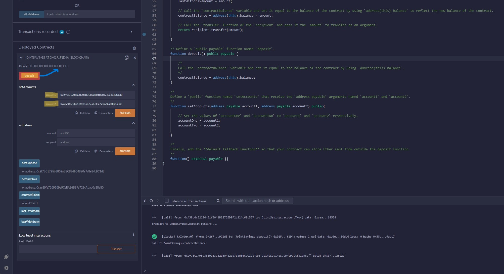
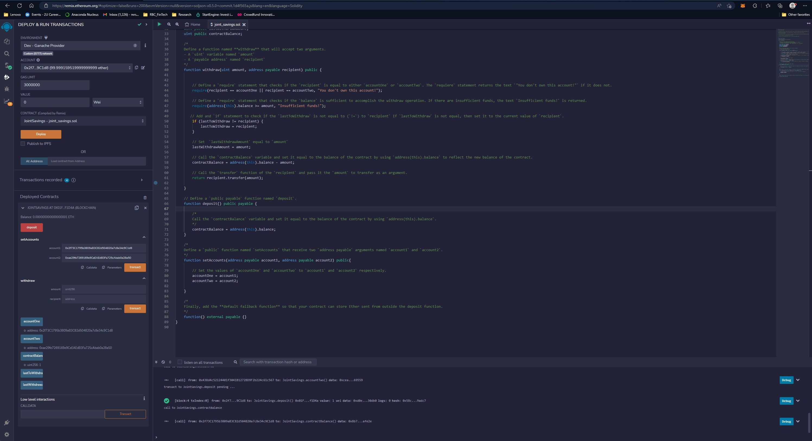
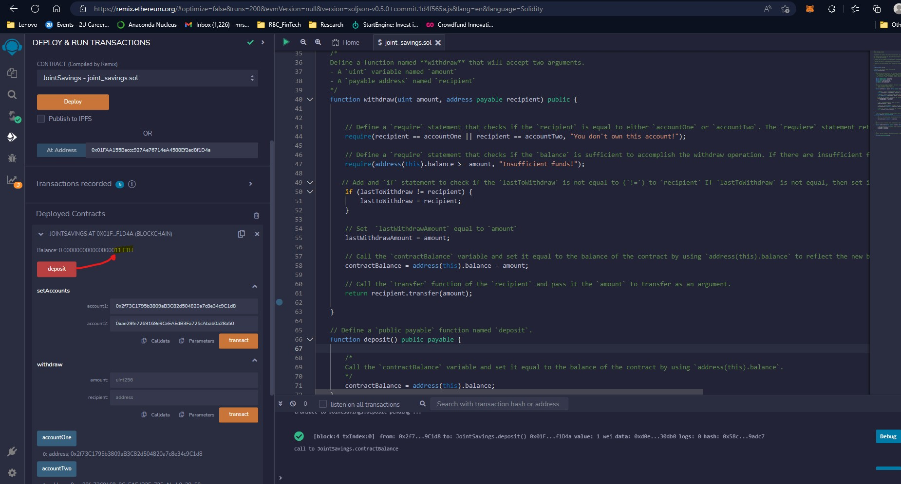
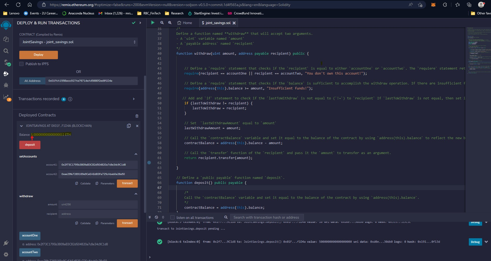
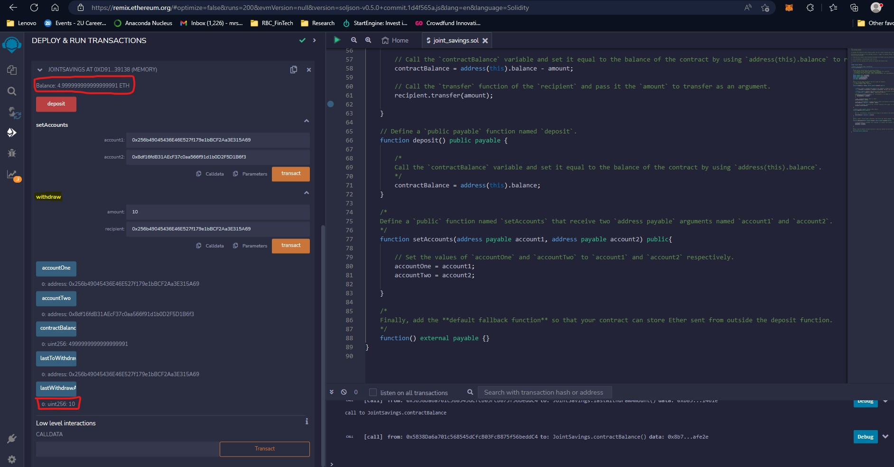

# RBC-HW20-Solidity-Challenge

## Solidity Challenge Module
Note: All related development has been applied to one solidity file within the "Starter Code" folder

## Please see below images of the deployed Smart Contract commands rendered on a web-based Remix IDE

### Sample Images:

### 1. Set Accounts Function:

### 2. Deposit Function:

### 3. All Withdraw Functions:

Disclaimer:
The smart contract deployed here required adjustment between deposit and withdrawl testing.
In result, you may notice some account variability between the above images that should be disregarded.
The images should still serve to validate complete functional integrity as is but please reach out if you have
reason to believe this is not the case.
